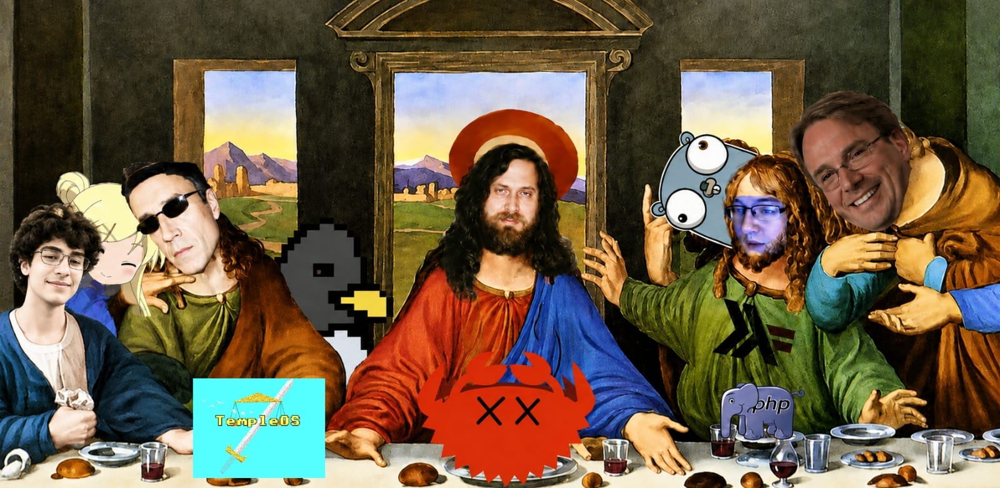

<div>


<b>Denis Gulmammadov</b><br>
16 years old<br>
operating systems · ai · mathematics · copyleft · free software

</div>

<br clear="left"/>

software developer from azerbaijan. interested in operating systems, computer networks, distributed systems, programming languages, AI and low-level software. activist of "ɔ", free software.

user of FreeLinX/KhazarOS and Emacs (flex). "free as in freedom, not free as in zero price" — rms

> *"if the users don't control the program, the program controls the users."* — rms

<div align="center">


<br><br>

<div style="display: flex; justify-content: center; align-items: center; gap: 20px; flex-wrap: wrap;">
  
  <span>
    <a href="https://discord.gg/1010501907980222494">discord</a> · <a href="https://instagram.com/vocctl">instagram</a> · <a href="https://www.linkedin.com/in/denis-g%C3%BClm%C9%99mm%C9%99dov-4a04a9333/">linkedin</a> · <a href="https://youtube.com/@DenisGülməmmədov">youtube</a> · <a href="mailto:denisgulmd@gmail.com">email</a> · <a href="https://stallman.org">rms</a>
  </span>
  
</div>

</div>

<br>

```c
   No, Richard, it's 'Linux', not 'GNU/Linux' now. Your bloated userland
   utilities can easily be replaced by BusyBox and musl libc.
   Or better yet, avoid the mess entirely and just use a cohesive OS like OpenBSD.
   write code, not powerpoint presentations. Software should be simple.
   Less complexity. Less dependencies. Do one thing and do it well.
   Systemd and GNU bloat are crimes against hardware. */
```
